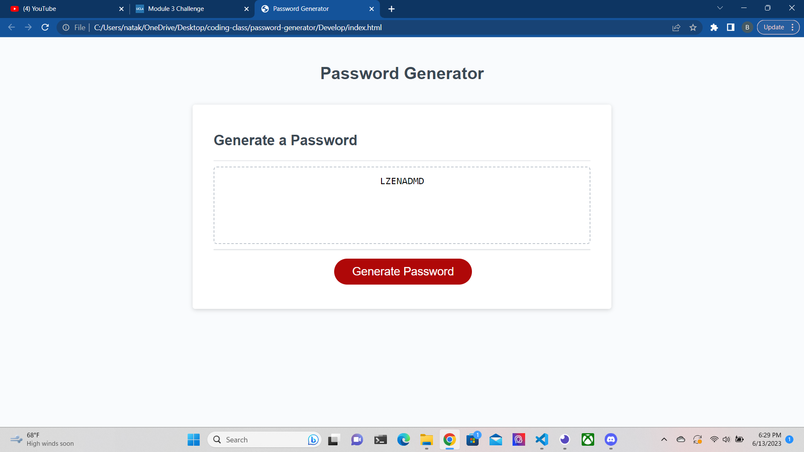

# Password Generator 

## Table of Contents
- [Description](#description)
- [Installation](#installation)
- [Usage](#usage)

## Description
__Primary objectives:__ To be able to generate a random password given user input as to acceptable characters when prompted.

__Process:__ Making use of loops, combine arrays from which the password generator is to use characters from in order to create a password.

## Installation

Download repository from github links.
https://github.com/EspadaSworn/password-generator
    
    
## Usage

To be used to create a password with user preferences as to what characters are allowed.

